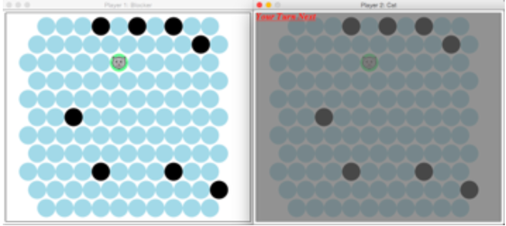

Chat Noir

Created by John Townsend, Amelia Hamilton and John Roehsler

Description:

Chat Noir is a popular online flash game in which the player tries to keep the cat from escaping off the board by blocking the spots the cat can move to. It was coded using Racket, a language now used mostly for teaching the fundamental concepts of Computer Science.
In the online game, the cat is controlled by an AI, but in ours, the cat is also a player. In the blocker’s turn, the player can block any spot by clicking on an empty tile. A blocked spot is then blacked out, and the cat cannot occupy it. In the cat’s turn, the player can move the cat to any adjacent and unblocked spot. If the cat reaches the edge of the board, the cat wins. It is up to the blocker to trap the cat on the board.

How to Play:

First, make sure you have downloaded DrRacket (http://racket-lang.org/download/) and
have the Chat Noir.rkt and Chat Noir Server.rkt in the same location on your computer. Open the Chat Noir Server.rkt and click run, then open the Chat Noir.rkt and click run. The blocking player has the first turn and can block any spot simply by clicking on it. The cat player can move to any adjacent and unblocked spot by clicking on it.
Goals: Cat player - Escape the board as quickly as possible. Block player - Trap the cat on the board and don't let it escape!

What I Learned:

In creating this project, I was instrumental in every aspect of the game. The design and graphics we had to create ourselves with no help from our professors. Working on this game, I gained a lot of knowledge surrounding Mouse Events, and how to use servers. Even my professors had limited knowledge on how to create a universe containing multiple worlds and having a server connect the worlds (because nobody does this work using DrRacket). The server takes a Mouse Event and changes the world and then sends the world as a package to the server. The server changes the turn of the players and updates both worlds. This work will be helpful when creating multiplayer games.

Notes:

Cat artwork from Google images
