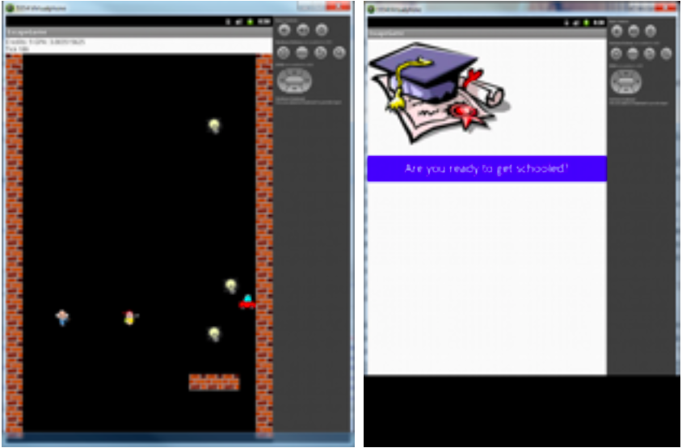

ESCAPE UD WITH A DEGREE

Brought to you by John Townsend and John Roehsler

Description:

You are a student on a journey to collect credits while avoiding obstacles like walls, cars and professors. The faster you get 125 credits, the higher your GPA. But avoiding obstacles also improves your grades. You can move in any direction as fast as you can tap. Year by year, credits pass you faster, and there are more things in your way. What will your final grade be? Start a new game or watch the computer play through to the end. The only way to fail out is by hitting the left or right wall. Do not run so fast that you cannot stop before it is too late!

How to Play:

➢ Move up, down, left and right by touching the screen to collect light bulbs as fast as you can.
➢ Avoid obstacles for better grades. Don’t leave the board!
Make sure you have an android phone or android virtual device (made for android 2.3.3).

What I Learned:

I learned how to take the concepts of coding from my first class, where we coded in DrRacket, and applied these concepts in Java. I also gained experience in creating simple AI, which you can see play the game. I learned a lot about android development by using Touch Events, creating buttons, and using virtual devices on my computer.
Sound files (not working) from freesound.org Most artwork from Google images
You are a student on a journey to collect credits while avoiding obstacles like walls, cars and professors. The faster you get 125 credits, the higher your GPA. But avoiding obstacles also improves your grades. You can move in any direction as fast as you can tap. Year by year, credits pass you faster, and there are more things in your way. What will your final grade be? Start a new

Notes:

This game is coded in Java using Eclipse (https://eclipse.org/downloads/). Some of the
code was provided by our Professors, who essentially gave us the foundation for making this game.