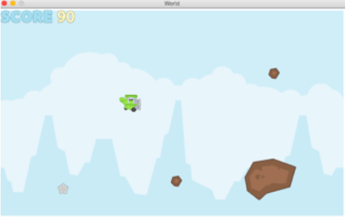

Flappy Plane

Game created by John Townsend and Kenny Rosenberg.

Description:
Flappy Plane was the first big project and game I worked on in Computer Science. It was coded using DrRacket, a language now used mostly for teaching the fundamental concepts of computer science. Flappy Plane is roughly based on the popular mobile game, Flappy Bird. We were given all the graphics used in the game along with the collision.rkt and vex.rkt by our professors. We were walked through creating and moving the plane, but the rest of the game, including parts of the game design, were up to us. While working on this game with my partner, we helped in each aspect of the game. I mainly focused on the score mechanics, key events, and creating the GameWorld, which contained every element of our game. The stars and rocks are all generated randomly after the initial start. New rocks are generated after the old rocks are off the screen, and stars are generated after they are collected or are off the screen. The size, speed, and type is randomly assigned for each element.

How to Play:

First, make sure that the Flappy Plane.rkt, collision.rkt and vex.rkt files are all located in the same place. Open Flappy Plane.rkt in DrRacket (http://racket-lang.org/download/) and click run. The plane is controlled by the arrow keys and will have an increased effect if you hold down the arrow key. The goal is to collect stars while avoiding the rocks. You receive 5 points for a bronze star, 10 for a silver star, and 20 for a gold star.
What I Learned:

By creating this game, I gained a lot of knowledge about manipulating lists. I had to take the player’s score, an integer, and make the integer into a list. For example, a score of 450 had to become a list of 4, 5, and 0. From here, I had to generate an image for each number in the list to create the score image for the game and allow it to be easily updated. Looking back on my code from a year ago, this seems trivial, but at the time, I was proud at finding the proper functions to make this work.
I also became much more experienced with how Key Events work and how they affect individual elements within a game, as well as how the GameWorld handles Key Events in every element of the game. This knowledge served me well in handling future Key, Mouse, and Touch Events for other games.

Notes:
All artwork provided by our professors.
   